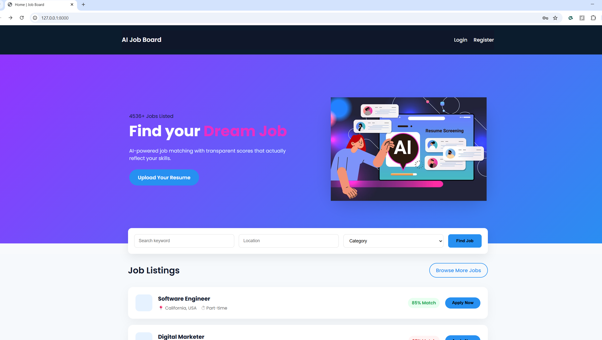
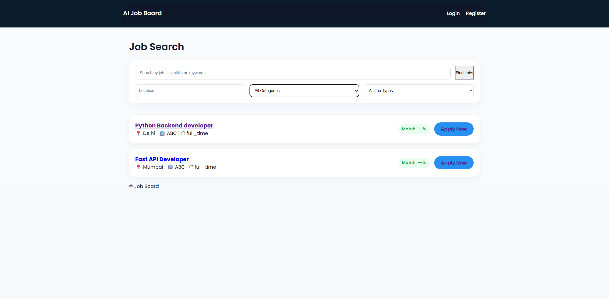
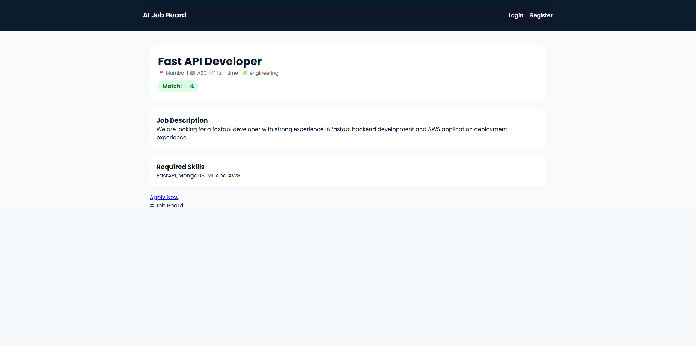

# 🚀 Line.IO: AI-Powered Hiring Platform

### Bridging the gap between Talent and Opportunity using NLP.

**Line.IO** is a full-stack HR Tech platform that automates the initial screening process. Unlike standard job portals, it uses **Natural Language Processing (NLP)** to semantically match candidate resumes against job descriptions, helping recruiters focus on the most relevant talent instantly.

> **Why this project?**
> With 13+ years of experience in HR Leadership, I realized that the biggest bottleneck in hiring isn't *finding* applicants, but *filtering* them. I built this system to solve the "Resume Black Hole" problem using a data-driven approach.

---

## 🏗️ Architecture & Workflow

The system is designed as a **Modular Monolith** (migrating to Microservices).

1.  **Recruiters** post jobs with specific technical requirements.
2.  **Candidates** create profiles and upload resumes (PDF/DOCX).
3.  **The Parser Engine** extracts raw text from documents using `pdfminer` and `python-docx`.
4.  **The AI Matcher** vectorizes the text (TF-IDF) and calculates a **Cosine Similarity Score** between the resume and the Job Description (JD).
5.  **The Dashboard** ranks candidates by relevance, not just by "date applied."

---

## ✨ Key Features

### 🔐 Role-Based Authentication
* **Custom User Models:** Distinct workflows for **Recruiters** and **Candidates**.
* **Security:** JWT-based authentication (Planned) and secure password hashing.

### 📄 Intelligent Resume Parsing
* **Format Agnostic:** Automatically extracts text from both `.pdf` and `.docx` files.
* **Auto-Population:** Extracts key details to populate candidate profiles automatically.

### 🧠 AI-Driven Matching Engine
* **Scikit-Learn Integration:** Uses TF-IDF Vectorization to convert text into mathematical variance.
* **Relevance Scoring:** Assigns a 0-100% match score to every application.
* **Domain logic:** Filters "spam" applications that don't meet minimum experience thresholds.

### 🔍 Advanced Search & Filtering
* **Recruiter Dashboard:** Search the resume database by Keywords, Location, Notice Period, and Experience.
* **Job Discovery:** Candidates can filter active jobs by skills and location.

---

## 📸 Project Screenshots

### 1. Landing Page
*View of the dashboard where recruiters can manage job postings and see applicant stats.*

### 2. Job Search
*The AI engine analyzing a candidate's resume against a job description.*

### 3. Job Details
*Candidate view showing the job search interface with location and experience filters.*

## 🛠️ Tech Stack

| Component | Technology | Use Case |
| :--- | :--- | :--- |
| **Backend Framework** | **Django 5.0** | Core business logic, ORM, Admin Panel |
| **API Layer** | **Django REST Framework** | Exposing data to frontend clients |
| **Machine Learning** | **Scikit-Learn, NumPy** | Vectorization & Similarity calculation |
| **Data Processing** | **Pdfminer.six, Python-docx** | File parsing and text extraction |
| **Database** | **SQLite** (Dev) / **PostgreSQL** (Prod) | Relational data storage |
| **Deployment** | **Docker** (Planned) | Containerization for reproducible builds |

---

